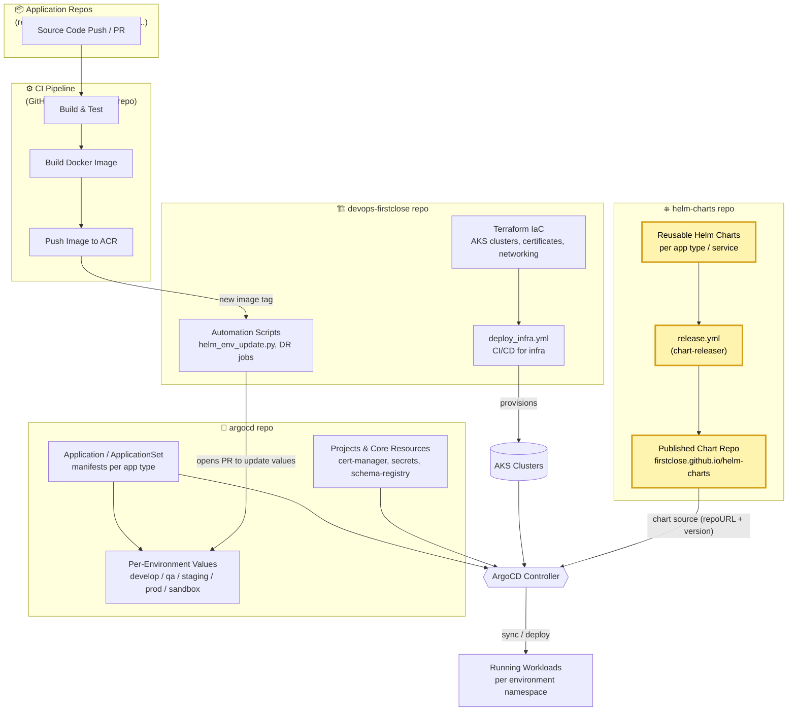

# helm-charts
  
Helm Charts used for Firstclose Deployments  

## GitOps Solution Overview

This repo (highlighted below) is the packaging layer of the pipeline: it defines
reusable Helm charts per app type and publishes them as a Helm chart repository via
`release.yml` (chart-releaser). [`argocd`](https://github.com/FirstClose/argocd)
references these published charts by version, and [`devops-firstclose`](https://github.com/FirstClose/devops-firstclose)
provisions the AKS clusters they get deployed onto.

**This repo's role:** hosts each service's Helm chart under `charts/` (react,
nestjs, aspnet, vite, fcone, kafka, nifi, limacharlie, ...). On merge to `main`,
`release.yml` packages and publishes new chart versions to the GitHub Pages chart
repo consumed by `argocd`.

## Usage

[Helm](https://helm.sh) must be installed to use the charts.  Please refer to
Helm's [documentation](https://helm.sh/docs) to get started.

Once Helm has been set up correctly, add the repo as follows:

  helm repo add firstclose https://firstclose.github.io/helm-charts

If you had already added this repo earlier, run `helm repo update` to retrieve
the latest versions of the packages.  You can then run `helm search repo
FirstClose` to see the charts.

To install the <chart-name> chart:

    helm install my-<chart-name> firstclose/<chart-name>

To uninstall the chart:

    helm delete my-<chart-name>
